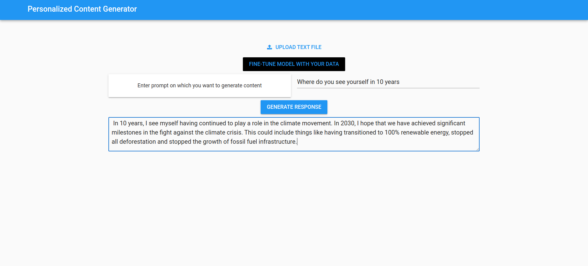

# Personalized Content Generator AI

 <!-- Replace with the actual path to the logo -->

## Overview

The Personalized Content Generator AI uses Large Language Models (LLMs) to generate human-like text based on personalized data. By leveraging deep learning techniques, these models perform tasks such as sentiment analysis, text generation, and text summarization. We implemented this project using transfer learning, fine-tuning pre-trained LLMs with customized datasets for optimized performance.

## Features

- **Data Collection**: Fetches tweets using the Twitter API and Tweepy library.
- **Data Cleaning and Preprocessing**: Utilizes spaCy and NLTK libraries for data cleaning, including token matching, lowercasing, punctuation removal, stemming, and stopword elimination.
- **Prompt-Response Pair Generation**: Creates prompt-response pairs using a secondary open-source LLM from Mistral AI, formatted for supervised fine-tuning.
- **Model Fine-Tuning**: Fine-tunes open-source LLMs from HuggingFace, using LoRa and QLoRa for model optimization.
- **Security and Pipeline Implementation**: Uses HuggingFace’s access-token for secure model handling and pipeline setup.

## Implementation

### Backend

1. **Data Collection and Scraping**:
   - Used the Twitter Developer’s API via Tweepy to fetch tweets.
   - Saved tweets to a text file for further processing.

2. **Data Cleaning**:
   - Applied token matching to remove non-ASCII characters.
   - Converted text to lowercase, removed punctuation, performed stemming, and removed stopwords.

3. **Prompt-Response Generation**:
   - Generated prompt-answer pairs using various LLMs.
   - Employed the Mistral-7B-instruct model due to computational constraints and evaluation metrics.

4. **Model Fine-Tuning**:
   - Fine-tuned the primary model, Llama-2-7b-chat, with prompt-answer pairs.
   - Used Quantized Low Rank Adaptation (QLoRa) for efficient training.
   - Configured training with specific hyperparameters and utilized the paged_adamw_32bit optimizer.

5. **Security and Deployment**:
   - Used Google Colab for model training due to limited local resources.
   - Secured the pipeline with user authentication and access tokens for personalized content generation.

### Frontend

- **User Interface**: 
  - Developed a web application using Anvil, a free open-source tool for creating customizable web apps.
  - Integrated Python backend with Anvil servers for model execution via callable functions.
